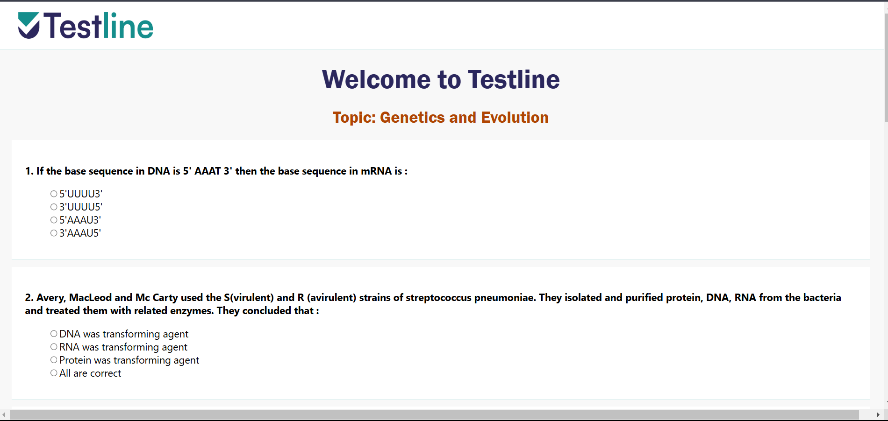
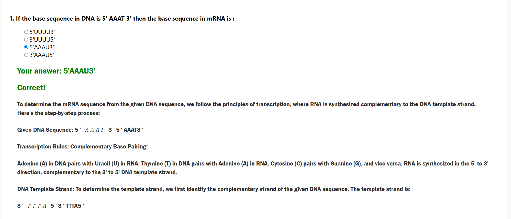
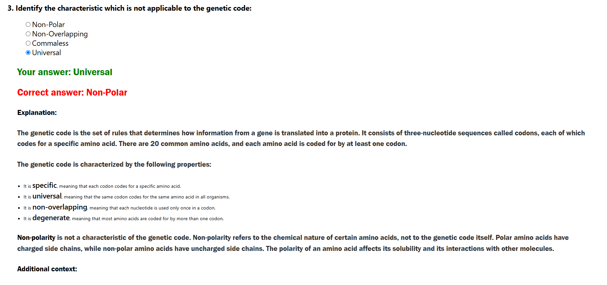
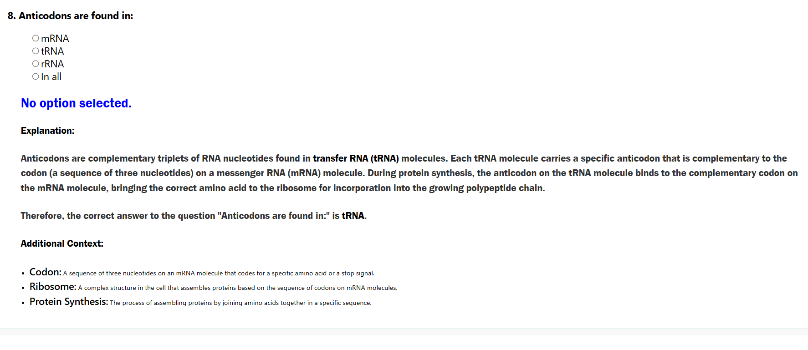
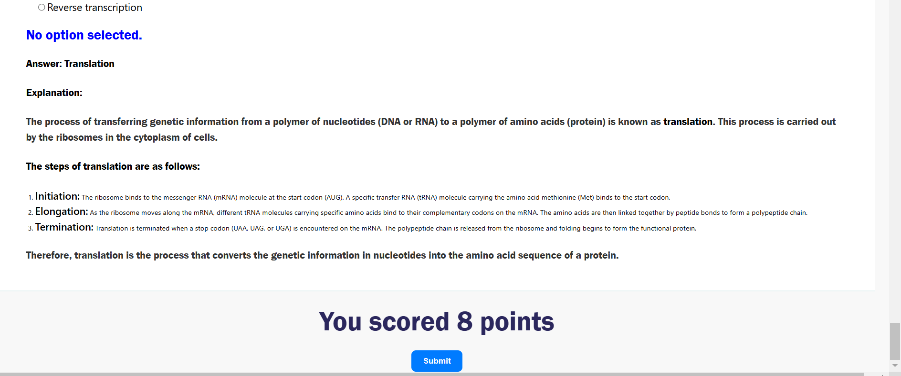

<<<<<<< HEAD
<<<<<<< HEAD
# React + Vite

This template provides a minimal setup to get React working in Vite with HMR and some ESLint rules.

Currently, two official plugins are available:

- [@vitejs/plugin-react](https://github.com/vitejs/vite-plugin-react/blob/main/packages/plugin-react/README.md) uses [Babel](https://babeljs.io/) for Fast Refresh
- [@vitejs/plugin-react-swc](https://github.com/vitejs/vite-plugin-react-swc) uses [SWC](https://swc.rs/) for Fast Refresh
=======
=======
>>>>>>> 5d36af004537114f0367572d6dfb4da685c2a9a7
# Testline-assignment
Assignment from testline

Testline Quiz Application

This project is a simple quiz application that fetches questions from an API and allows users to select answers. After submission, users receive immediate feedback with explanations.

Features

Fetches quiz questions dynamically from an API.
Users can select one option per question.
Shows feedback after submission:
Correct answer
Incorrect answer with the correct answer displayed
No selection message
Displays the final score.
Scrolls to the result section upon submission.

Installation

Clone the repository:git clone https://github.com/your-repo/testline-quiz.git

Install dependencies:npm install

Start the application:npm run dev

Usage

The application fetches quiz data from the API when loaded.

Users can select an answer for each question.

Clicking Submit displays feedback and the final score.

The page scrolls down to show the results.

Screenshots

1️⃣ Questions Displayed
(src/assets/questions2.png)(src/assets/questions3.png)

2️⃣ Correct Option Selected
(src/assets/correct2.png)

3️⃣ Incorrect Option Selected
(src/assets/incorrect2.png)

4️⃣ No Option Selected
(src/assets/no-option2.png)

5️⃣ Final Score Displayed

Technologies Used:-React.js,React Markdown,CSS
<<<<<<< HEAD
>>>>>>> origin/main
=======
>>>>>>> 5d36af004537114f0367572d6dfb4da685c2a9a7
